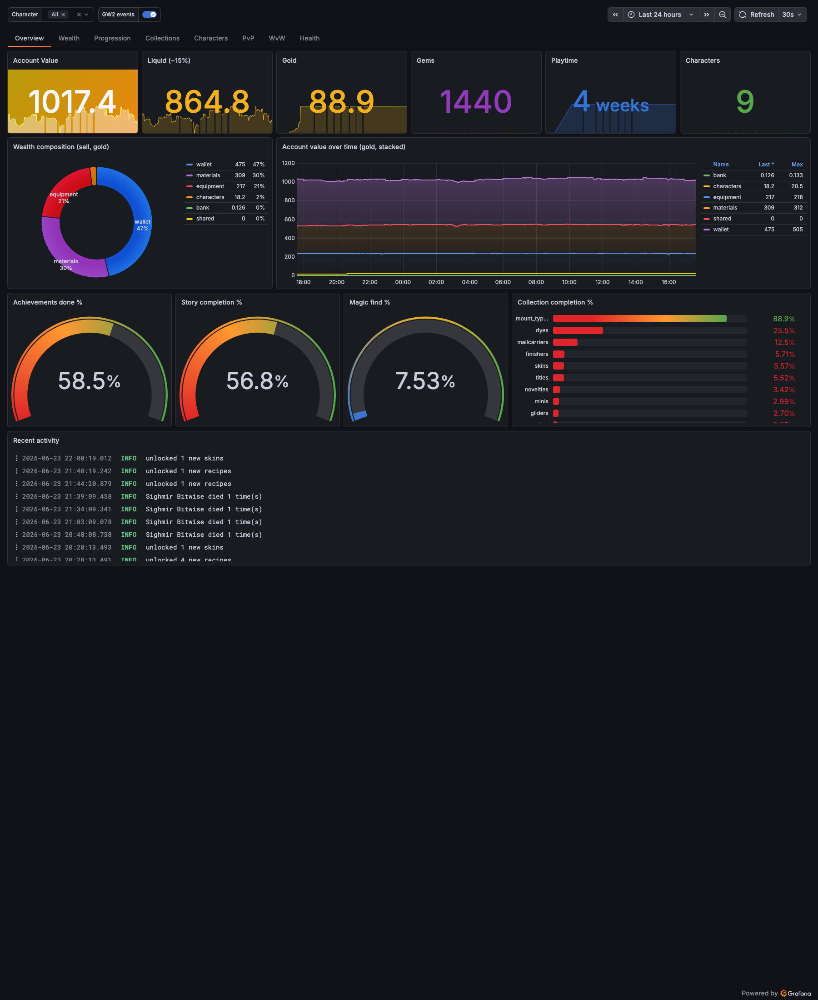
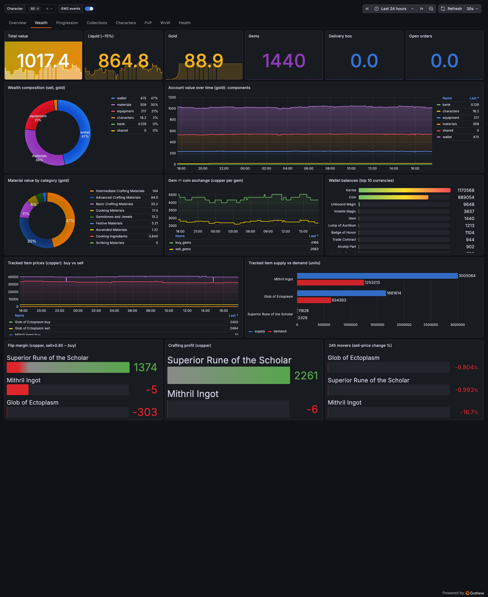
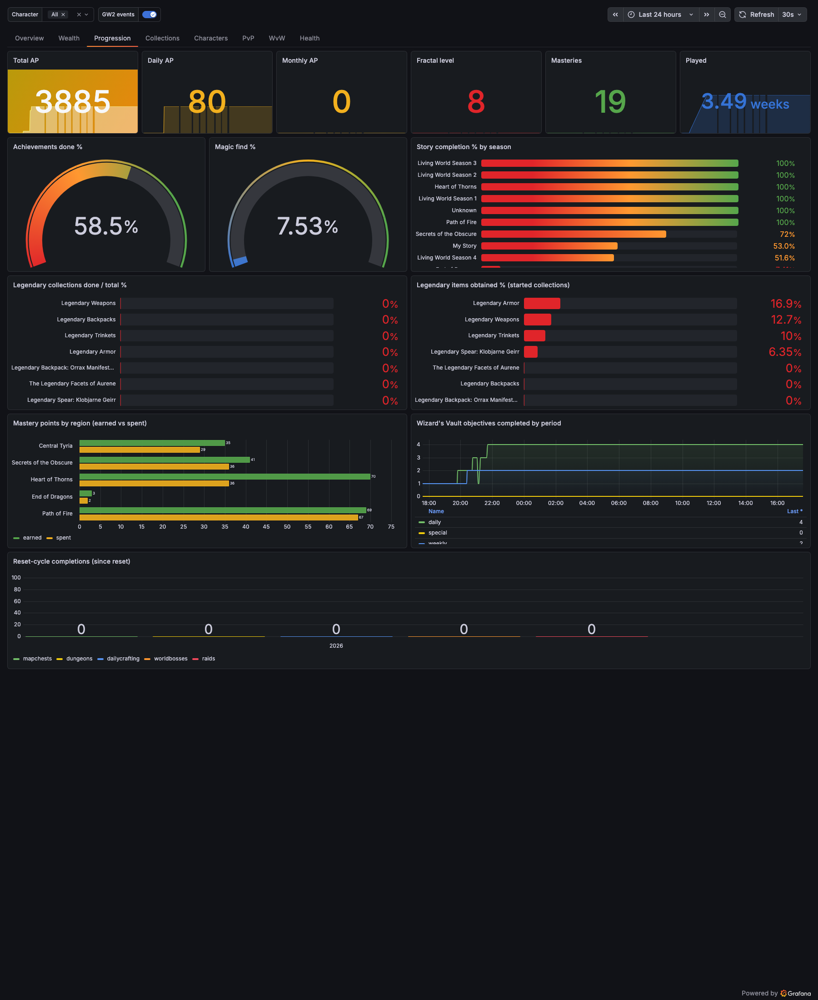
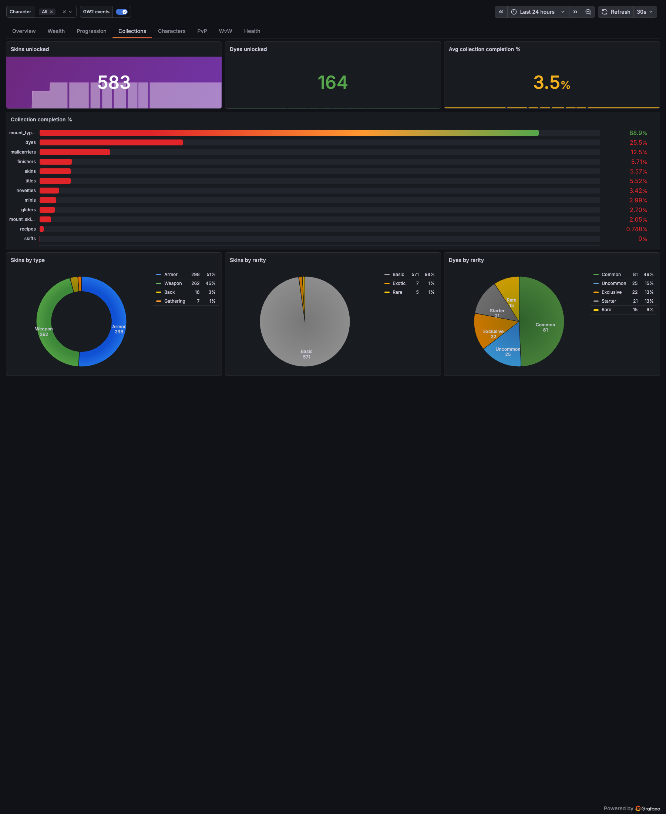
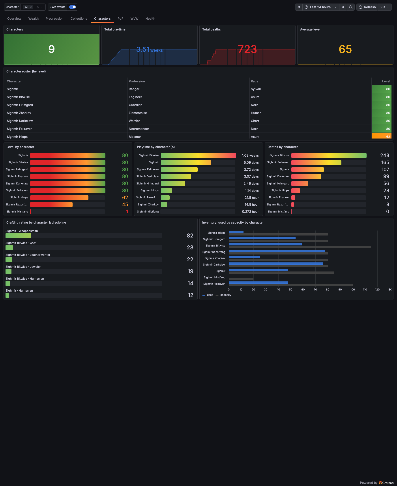
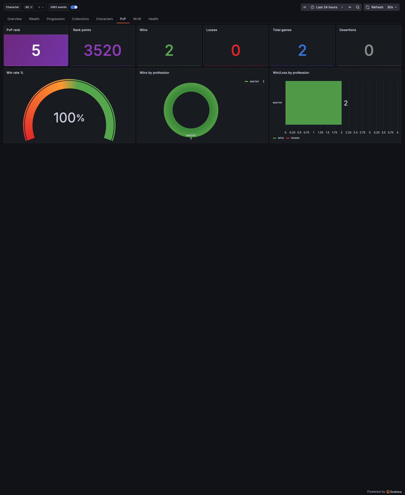
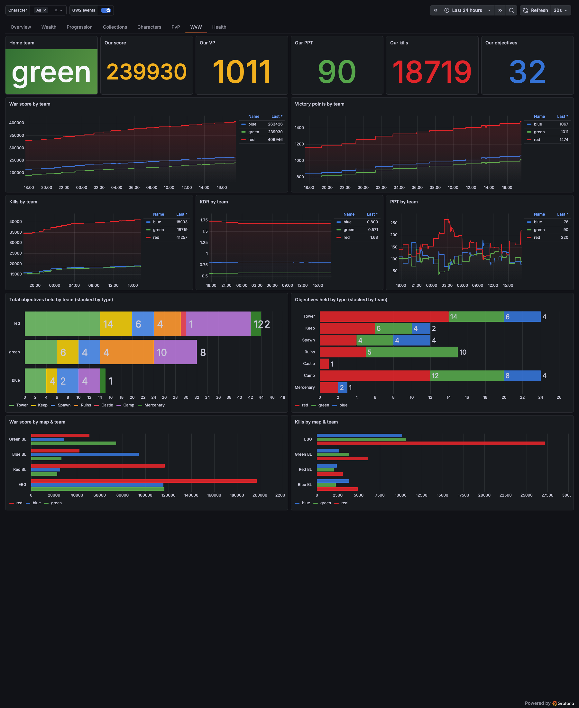
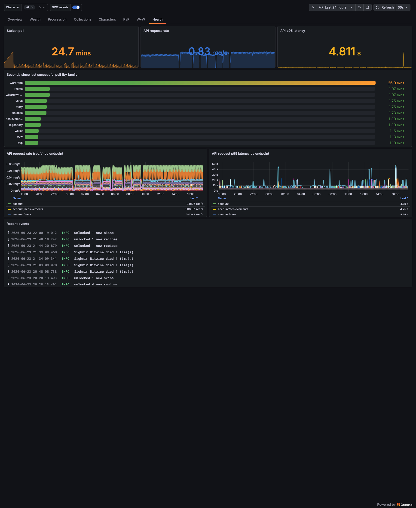

# gw2-otel-collector

An OpenTelemetry collector for **Guild Wars 2**. It polls the official
[GW2 API v2](https://wiki.guildwars2.com/wiki/API:Main) with an account API key,
turns the data into OpenTelemetry **metrics, logs, and traces**, and exports them
over OTLP to a backend (Prometheus + Loki + Tempo, or Grafana Cloud). The result
is a Grafana dashboard that tracks what [gw2efficiency](https://gw2efficiency.com/)
and [gw2storytracker](https://gw2storytracker.com/) surface — wealth, progression,
collections, PvP/WvW — in your own observability stack, with history you control,
alerting, and custom panels.



## Why an OTel pipeline fits

**The GW2 API is snapshot-only.** It exposes *current* state (prices, balances,
ranks, unlock sets) and a handful of *lifetime cumulative* fields (playtime,
deaths, AP, PvP wins, luck) — but stores almost no history itself. Every
"over time" view (gold history, account-value curve, price charts, win-rate
trends) has to be built by something that **polls and persists**. That is exactly
what a metrics/logs pipeline is for, so the collector's core value-add is being
the historian the API isn't — a clean fit, not a workaround.

The economy and progression data is rich: ~70 wallet currencies, trading-post
prices and your own transactions, computed account value, achievement points,
masteries, luck, playtime, and collection-completion percentages all map cleanly
to gauges and counters.

## What it collects

- **Wealth & economy** — computed account value (total + per component: bank,
  materials, shared, characters, equipped-gear runes/sigils, wallet) at buy/sell
  basis; per-currency wallet; gem⇄coin exchange; delivery box; per-item watchlist
  price/spread/flip-margin/supply/demand; open orders; material value by category;
  single-level crafting profit; 24h price movers.
- **Progression** — computed total AP, achievements done/%, masteries & mastery
  points by region, luck → magic-find %, fractal level & augmentations, legendary
  armory, per-character crafting, story completion % by season, Wizard's Vault, and
  legendary/precursor collection progress.
- **Characters** — level, playtime, deaths, profession/race, inventory used vs
  capacity, crafting ratings; a per-character drill-down.
- **Collections & wardrobe** — 14 unlock collections with completion %, unlocked
  skins by type/rarity, dyes by rarity.
- **PvP** — rank, per-profession & per-ladder W/L, season standings; the last ~10
  games emitted as events.
- **WvW** — public matchup data: per-team score / VP / kills / deaths / KDR / PPT,
  objectives held by team and type, and per-map (EBG + 3 borderlands) breakdown.
- **Events** (snapshot diff → logs) — level-ups, deaths, collection unlocks,
  reset-cycle completions, trading-post transactions, PvP games, guild-log entries.
  Backed by `bbolt` (diff baselines + a seen-set) for at-least-once, restart-safe
  emission.
- **Self-observability** — API request rate/duration (with trace exemplars) and a
  last-successful-poll timestamp per endpoint family.

Reset-cycle activity (world bosses / dungeons / raids / map chests / daily crafting)
is tracked since reset, and traces parent a `poll <family>` span over a CLIENT span
per API request.

## Dashboard

One tabbed dashboard (Grafana 13 schema-v2 `TabsLayout`) generated **as code in Go**
via the [Grafana Foundation SDK](https://github.com/grafana/grafana-foundation-sdk)
(`go run ./deploy/dashboards` → `deploy/dashboards/gw2.json`), auto-provisioned into
the dev stack. A dense "command-center" design across 8 tabs — hero KPI bands with
sparklines, composition donuts, radial gauges, threshold-coloured bars, team-coloured
WvW, Loki **event annotations** overlaid on the time graphs, and a per-character
drill-down variable.

<details>
<summary><b>Screenshots — all 8 tabs</b></summary>

### Wealth & Economy


### Progression


### Collections


### Characters


### PvP


### WvW


### Collector Health


</details>

## Required API key scopes

Create a key at [account.arena.net/applications](https://account.arena.net/applications)
with these permissions:

`account`, `tradingpost`, `characters`, `wvw`, `pvp`, `progression`, `wallet`,
`guilds`, `builds`, `inventories`, `unlocks`

> `account` is mandatory and always present. The account's WvW *rank* is gated behind
> `progression`; public WvW match data needs no key. Guild sub-resources (treasury,
> stash, log) require a key belonging to the **guild leader** — they stay empty otherwise.

## Quick start (local dev)

Requires Go 1.26+ and Docker.

```sh
cp .env.example .env        # add your GW2_API_KEY
make build                  # build the binary
make test && make vet       # checks

# Run the full local stack (Grafana LGTM) + collector:
GW2_API_KEY=<key> make dev
# Grafana → http://localhost:3000 — the "GW2 Account" dashboard auto-provisions;
# metrics/logs arrive within ~15s (heavier families take a minute or two).
```

> The local LGTM stack exposes OTLP on host ports **14317/14318** (not the standard
> 4317/4318) to avoid colliding with a local Grafana Alloy. The collector's own
> default endpoint stays `http://localhost:4318`.

## Production (Grafana Cloud via Alloy)

The collector is egress-agnostic — it just speaks OTLP. The production path sends
that to a local **Grafana Alloy**, which forwards to **Grafana Cloud**. The binary
is identical to dev; only `OTEL_EXPORTER_OTLP_ENDPOINT` changes. Alloy's pipeline is
in [`deploy/alloy/config.alloy`](deploy/alloy/config.alloy) (OTLP receiver → batch →
OTLP/HTTP to Grafana Cloud with basic auth).

```sh
GW2_API_KEY=<key> \
GRAFANA_CLOUD_OTLP_ENDPOINT=https://otlp-gateway-<region>.grafana.net/otlp \
GRAFANA_CLOUD_INSTANCE_ID=<instance-id> \
GRAFANA_CLOUD_API_KEY=<token> \
docker compose -f deploy/docker-compose.prod.yaml up --build
# Alloy UI → http://localhost:12345
```

Alloy-averse setups can skip it entirely and point `OTEL_EXPORTER_OTLP_ENDPOINT`
(plus `OTEL_EXPORTER_OTLP_HEADERS` for auth) straight at Grafana Cloud.

### Already running Alloy? (bring your own)

If you already run a Grafana Alloy on this machine, **don't** use the prod compose
(it starts its own Alloy). Just run the binary — its default endpoint is
`http://localhost:4318`, so it targets your Alloy with no override:

```sh
make build
GW2_API_KEY=<key> make run      # → exports to your local Alloy on :4318
```

Running the collector in a container instead? Point it at the host:
`OTEL_EXPORTER_OTLP_ENDPOINT=http://host.docker.internal:4318`. Your Alloy just
needs an `otelcol.receiver.otlp` wired to its export pipeline; if it doesn't have
one, copy the receiver/batch/exporter components from
[`deploy/alloy/config.alloy`](deploy/alloy/config.alloy). The dev stack's
14317/14318 ports mean you can run both at once.

## Alerting

Grafana alert rules are provisioned as code from
[`deploy/grafana/provisioning/alerting/rules.yaml`](deploy/grafana/provisioning/alerting/rules.yaml)
(folder **GW2**), auto-loaded by the dev stack: collector-not-polling and GW2-API-5xx
(health), bank/shared near-full (storage), and cheap-gems / flip-margin (economy
opportunities). For Grafana Cloud, import the same rules.

## Configuration

All configuration is environment variables (12-factor):

| Variable | Default | Purpose |
|---|---|---|
| `GW2_API_KEY` | *(required)* | Account API key |
| `OTEL_EXPORTER_OTLP_ENDPOINT` | `http://localhost:4318` | OTLP target (Alloy, LGTM, Grafana Cloud) |
| `OTEL_EXPORTER_OTLP_HEADERS` | — | Standard OTLP headers (e.g. auth for direct Cloud export) |
| `GW2_TRACK_ITEMS` | *(empty)* | Comma-separated item IDs for the price/flip/craft watchlist |
| `GW2_STATE_PATH` | `state.db` | Path to the `bbolt` event-state database |
| `GW2_EXPORT_INTERVAL` | `30s` | OTLP export/flush interval |
| `GW2_INTERVAL_<FAMILY>` | per-family | Poll cadence per endpoint family (`ACCOUNT`, `WALLET`, `VALUE`, …) |
| `GW2_LOG_LEVEL` | `info` | `debug` / `info` / `warn` / `error` |
| `GW2_SCHEMA_VERSION` | `latest` | Pinned GW2 API `?v=` schema version |

## Architecture

A standalone Go daemon, egress-agnostic over OTLP. It owns its own per-family
scheduler, a shared token-bucket rate limiter (~5 req/s, per the API's per-IP
limit), snapshot diffing, and a build-gated reference cache (id→name tables,
refreshed only when `/v2/build` changes, via a lock-free atomic-pointer swap).
The same binary drives direct-OTLP → local LGTM (dev), app → Alloy → Grafana Cloud
(prod), or direct → Grafana Cloud — only the endpoint differs. Every "over time"
view is the collector persisting snapshots; every gold *value* is computed
(item count × trading-post price), never fetched.

## Not possible from the API

Combat telemetry (DPS, boons, rotations — needs arcdps logs, the
[gw2wingman](https://gw2wingman.nevermindcreations.de/) domain), per-account WvW
kills/captures (team-level only), PvP history beyond the last 10 games, per-character
map-completion %, gem-store catalog prices, and global PvP leaderboards as account data.

## License

[Apache License 2.0](LICENSE).
